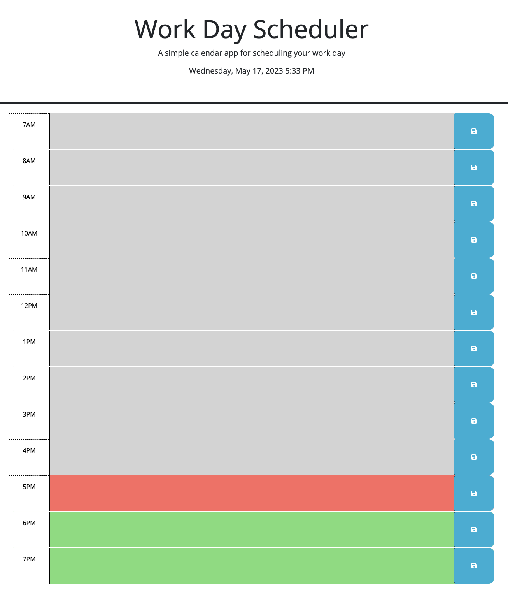

# Work Day Scheduler (daily-planner)
Module 5 Challenge Third-Party APIs: Work Day Scheduler

## Description

This Work Day Scheduler is a simple calendar application to help plan and manage time efficiently with a busy working schedule. The app allows you to add and save important events for each hour of the day. The use of Day.js library and jQuery creates a dynamic calendar for work day planning. Based on the current hour of the day, the colors indicate whether it is in the past (grey), present (red), or future (green).

## Usage

The current date and time are displayed at the top of the calendar. You can scroll down to view the hourly time blocks for the current day. Select the time block to type in the events and click the save button on the right. This will save the event in the local storage and upon refreshing the page, you should be able to view the saved changes on the calendar. Based on the current hour of the day, the colors indicate whether it is in the past (grey), present (red), or future (green).

The following image shows an example of the application's appearance:

The following animation demonstrates the application functionality:

Link to deployed application: https://suzyhan.github.io/daily-planner/

## Credits

Day.js (https://day.js.org/) library and jQuery UI (https://jqueryui.com/) were used to create a dynamic scheduler. 

Reviews of the following tutorials used to build the application:

https://www.w3schools.com/

https://developer.mozilla.org/en-US/

## License

None